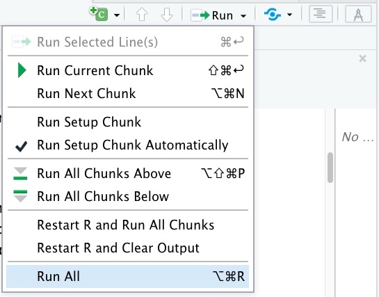

---
editor_options:
  markdown:
    wrap: 72
output: pdf_document
---

**University of Edinburgh**

**School of Mathematics**

**Bayesian Data Analysis, 2022/2023, Semester 2**

**Assignment 1**

**IMPORTANT INFORMATION ABOUT THE ASSIGNMENT**

**In this paragraph, we summarize the essential information about this
assignment. The format and rules for this assignment are different from
your other courses, so please pay attention.**

**1) Deadline: The deadline for submitting your solutions to this
assignment is the 6 March 12:00 noon Edinburgh time.**

**2) Format: You will need to submit your work as 2 components: a PDF
report, and your R Markdown (.Rmd) notebook. There will be two separate
submission systems on Learn: Gradescope for the report in PDF format,
and a Learn assignment for the code in Rmd format. You need to write
your solutions into this R Markdown notebook (code in R chunks and
explanations in Markdown chunks), and then select Knit/Knit to PDF in
RStudio to create a PDF report.**

{width="192"}

**The compiled PDF needs to contain everything in this notebook, with
your code sections clearly visible (not hidden), and the output of your
code included. Reports without the code displayed in the PDF, or without
the output of your code included in the PDF will be marked as 0, with
the only feedback "Report did not meet submission requirements".**

**You need to upload this PDF in Gradescope submission system, and your
Rmd file in the Learn assignment submission system. You will be required
to tag every sub question on Gradescope.**

**Some key points that are different from other courses:**

**a) Your report needs to contain written explanation for each question
that you solve, and some numbers or plots showing your results.
Solutions without written explanation that clearly demonstrates that you
understand what you are doing will be marked as 0 irrespectively whether
the numerics are correct or not.**

**b) Your code has to be possible to run for all questions by the Run
All in RStudio, and reproduce all of the numerics and plots in your
report (up to some small randomness due to stochasticity of Monte Carlo
simulations). The parts of the report that contain material that is not
reproduced by the code will not be marked (i.e. the score will be 0),
and the only feedback in this case will be that the results are not
reproducible from the code.**

{width="375"}

**c) Multiple Submissions are allowed BEFORE THE DEADLINE are allowed
for both the report, and the code.\
However, multiple submissions are NOT ALLOWED AFTER THE DEADLINE.\
YOU WILL NOT BE ABLE TO MAKE ANY CHANGES TO YOUR SUBMISSION AFTER THE
DEADLINE.\
Nevertheless, if you did not submit anything before the deadline, then
you can still submit your work after the deadline, but late penalties
will apply. The timing of the late penalties will be determined by the
time you have submitted BOTH the report, and the code (i.e. whichever
was submitted later counts).**

**We illustrate these rules by some examples:**

**Alice has spent a lot of time and effort on her assignment for BDA.
Unfortunately she has accidentally introduced a typo in her code in the
first question, and it did not run using Run All in RStudio. - Alice
will get 0 for the whole assignment, with the only feedback "Results are
not reproducible from the code".**

**Bob has spent a lot of time and effort on his assignment for BDA.
Unfortunately he forgot to submit his code. - Bob will get no personal
reminder to submit his code. Bob will get 0 for the whole assignment,
with the only feedback "Results are not reproducible from the code, as
the code was not submitted."**

**Charles has spent a lot of time and effort on his assignment for BDA.
He has submitted both his code and report in the correct formats.
However, he did not include any explanations in the report. Charles will
get 0 for the whole assignment, with the only feedback "Explanation is
missing."**

**Denise has spent a lot of time and effort on her assignment for BDA.
She has submitted her report in the correct format, but thought that she
can include her code as a link in the report, and upload it online (such
as Github, or Dropbox). - Denise will get 0 for the whole assignment,
with the only feedback "Code was not uploaded on Learn."**

**3) Group work: This is an INDIVIDUAL ASSIGNMENT, like a 2 week exam
for the course. Communication between students about the assignment
questions is not permitted. Students who submit work that has not been
done individually will be reported for Academic Misconduct, that can
lead to serious consequences. Each problem will be marked by a single
instructor, so we will be able to spot students who copy.**

**4) Piazza: During the periods of the assignments, the instructor will
change Piazza to allow messaging the instructors only, i.e. students
will not see each others messages and replies.**

**Only questions regarding clarification of the statement of the
problems will be answered by the instructors. The instructors will not
give you any information related to the solution of the problems, such
questions will be simply answered as "This is not about the statement of
the problem so we cannot answer your question."**

**THE INSTRUCTORS ARE NOT GOING TO DEBUG YOUR CODE, AND YOU ARE ASSESSED
ON YOUR ABILITY TO RESOLVE ANY CODING OR TECHNICAL DIFFICULTIES THAT YOU
ENCOUNTER ON YOUR OWN.**

**5) Office hours: There will be two office hours per week (Monday
14:00-15:00, and Wednesdays 15:00-16:00) during the 2 weeks for this
assignment. The links are available on Learn / Course Information. I
will be happy to discuss the course/workshop materials. However, I will
only answer questions about the assignment that require clarifying the
statement of the problems, and will not give you any information about
the solutions. Students who ask for feedback on their assignment
solutions during office hours will be removed from the meeting.**

**6) Late submissions and extensions: NO EXTENSIONS ARE ALLOWED FOR THIS
ASSIGNMENT, AND THERE IS NO SUCH OPTION PROVIDED IN THE ESC SYSTEM.
Students who have existing Learning Adjustments in Euclid will be
allowed to have the same adjustments applied to this course as well, but
they need to apply for this BEFORE THE DEADLINE on the website**

<https://www.ed.ac.uk/student-administration/extensions-special-circumstances>

**by clicking on "Access your learning adjustment". This will be
approved automatically.**

**Students who submit their work late will have late submission
penalties applied by the ESC team automatically (this means that even if
you are 1 second late because of your internet connection was slow, the
penalties will still apply). The penalties are 5% of the total mark
deduced for every day of delay started (i.e. one minute of delay counts
for 1 day). The course instructors do not have any role in setting these
penalties, we will not be able to change them.**

```{r}
rm(list = ls(all = TRUE))
#Do not delete this!
#It clears all variables to ensure reproducibility
```


**Problem 1**

**In this problem, we study a dataset about currency exchange rates. The
exrates dataset of the stochvol package contains the daily average
exchange rates of 24 currencies versus the EUR, from 2000-01-03 until
2012-04-04.**

```{r}
require(stochvol)
data("exrates")

#The first 6 rows of the dataframe
print.data.frame(exrates[1:6,])

cat(paste("Data from ", min(exrates$date)," until ",max(exrates$date)))
```

**As we can see, not all dates are included in the dataset. Some are
missing, such as weekends, and public holidays.**

**In this problem, we are going to fit a various stochastic volatility
models on this dataset (see e.g.
<https://www.jstor.org/stable/1392251>).**

**a)[10 marks] Consider the following leveraged Stochastic Volatility
(SV) model.**

$\begin{aligned} y_t&=\beta_0+\beta_1 y_{t-1}+\exp(h_t/2)\epsilon_t \quad \text{for}\quad 1\le t\le T,\\ h_{t+1}&=\mu+\phi(h_t-\mu)+\sigma \eta_t\quad \text{for} \quad 0\le t\le T, \quad h_0\sim N(\mu, \sigma^2/(1-\phi^2)),\\(\epsilon_t,\eta_t)&\sim N\left(0, \Sigma_{\rho}\right)\quad \text{ for } \quad \Sigma_{\rho}=\left(\begin{matrix}1 & \rho\\ \rho & 1\end{matrix}\right). \end{aligned}$

**Here** $t$ **is the time index,** $y_t$ **are the observations (such
as daily USD/EUR rate),** $h_t$ **are the log-variance process,**
$\epsilon_t$ **is the observation noise, and** $\eta_t$ **is the
log-variance process noise (which are correlated, but independent for
different values of** \$t\$**). The hyperparameters are**
$\beta_0, \beta_1, \mu, \phi, \sigma, \rho$**.**

**For stability, it is necessary to have** $\phi\in (-1,1)$**, and by
the definition of correlation matrices, we have** $\rho\in [-1,1]$**.**

**Implement this model in JAGS or Stan on the first 3 months of USD/EUR
data from the dataset, i.e. from dates 2000-01-03 until 2000-04-02.**

**Explain how did you choose priors for all parameters. Explain how did
you take into account the days without observation in your model.**

**Fit the model, do convergence diagnostics, print out the summary of
the results, and discuss them.**

**Make sure that the Effective Sample Size is at least 1000 for all 6
hyperparameters (you need to choose burn-in and number of steps
appropriately for this).**


\textcolor{red}{remember to centre the data} 

```{r}
plot(eur2usd.centred)
```

```{r}
set.seed(1234)
```


```{r}
#model in BUGS syntax
model_string <- "model {
  # prior
  beta0 ~ dnorm(beta.mu.0, beta.tau.0)
  beta1 ~ dnorm(beta.mu.1, beta.tau.1)
  mu ~ dnorm(mu.mu,mu.tau)
  phi ~ dbeta(1,1)
  tau ~ dgamma(sigma.a,sigma.b)
  sigma <- pow(tau,-2)
  rho ~ dunif(-1,1)
  
  # Likelihood
  h[1] ~ dnorm(mu, (1-phi^2)*tau)
  #The evolution of the hidden states x according to the model
  for(i in 2:(n+1)) {
    h[i] ~ dnorm(mu+phi*(h[i-1]-mu), tau) 
  }
  
  y[1] ~ dnorm(mean.y0,prec.y0)
  y.var[1] <- pow(prec.y0,-1)
  for(i in 2:n) {
    y.mu[i] <- rho/sigma*exp(h[i]/2)*(h[i+1]-mu-phi*(h[i]-mu))+beta0 + beta1*y[i-1]
    y.var[i] <- exp(h[i])*(1-pow(rho,2)) + beta1^2*y.var[i-1]
    y[i] ~ dnorm(y.mu[i], pow(y.var[i],-1))
  }
  

  
}"
```


```{r}
# Create data input for JAGS
eur2usd <- exrates %>% 
  filter(date <= "2000/04/02") %>%
  mutate(date=as.numeric(date)) %>%
  select(USD,date) %>%
  mutate(date=date-date[1]+1,USD=log(USD))

n <- eur2usd$date[length(eur2usd$date)]
y <- rep(NA,n)
j <- 1
for(i in eur2usd$date){
  y[i] <- eur2usd$USD[j]
  j <- j+1
}
y <- y-mean(y,na.rm = TRUE)
#eur2usd_data <- data.frame(USD=rep(NA,eur2usd$date[length(eur2usd$date)],
#                           date=1:length(eur2usd$date))
  
eur2usd.centred <- eur2usd %>% 
  mutate(date=date-mean(date),USD=mean(USD))

n <- length(eur2usd)

eur2usd.data <- list(n=n,y=y,mean.y0=0,prec.y0=0.001,beta.mu.0=0,beta.tau.0=0.001,beta.mu.1=0,beta.tau.1=0.001,mu.mu=0,mu.tau=0.001,sigma.a=0.01,sigma.b=0.01)


model1.inits=list()
beta0.init=10
beta1.init=0.5
mu.init=0
phi.init=0.1
tau.init=100
rho.init=0

for(it in 1:5)
{
  model1.inits[[it]]<-list(beta0=beta0.init+rnorm(1,sd=1),beta1=beta1.init+rnorm(1,sd=1),
                           mu=mu.init+rnorm(1,sd=1),phi=phi.init+rnorm(1,sd=1),
                           tau=tau.init+rnorm(1,1), rho=rho.init+rnorm(1,1))
}

```

```{r}
num.chains <- 5
# Compile and run the model
model1 <- jags.model(file=textConnection(model_string), 
                        data=eur2usd.data,
                        n.chains=num.chains)
# Burnin for 20000 samples
update(model1,80000,progress.bar="none")
```


```{r}
# Running the model, monitoring the variable theta
res.model1=coda.samples(model1,variable.names=c("beta0", "beta1", "mu", "phi", "sigma", "rho"), n.iter=10000,progress.bar="none")

#Setting margins to be small
summary(res.model1); plot(res.model1)
effectiveSize(res.model1)
```

```{r}

gelman.diag(res.model1)

```
```{r}
gelman.plot(res.model1)
```

```{r}
effectiveSize(res.model1)
```


Explanation: (Write your explanation here)

**b)[10 marks] In practice, one often encounters outliers in exchange
rates. These can be sometimes modeled by assuming Student's t
distribution in the observation errors (i.e.** $\epsilon_t$). **The
robust leveraged SV model can be expressed as**

$\begin{aligned} y_t&=\beta_0+\beta_1 y_{t-1}+\exp(h_t/2)\epsilon_t \quad \text{for}\quad 1\le t\le T,\\ h_{t+1}&=\mu+\phi(h_t-\mu)+\sigma \eta_t\quad \text{for} \quad 0\le t\le T, \quad h_0\sim N(\mu, \sigma^2/(1-\phi^2)),\\ \eta_t&\sim N(0,1)\\ \epsilon_t|\eta_t&\sim t_{\nu}(\rho \eta_t ,1). \end{aligned}$

**Here** $\nu$ **is the degrees of freedom parameter (unknown).**

**Implement this model in JAGS or Stan on the first 3 months of USD/EUR
data from the dataset.**

**Explain how did you choose priors for all parameters. Explain how did
you take into account the days without observation in your model.**

**Fit the model, do convergence diagnostics, print out the summary of
the results, and discuss them.**

**Make sure that the Effective Sample Size is at least 1000 for all 6
hyperparameters (you need to choose burn-in and number of steps
appropriately for this).**

```{r}

```

Explanation: (Write your explanation here)

**c)[10 marks]**

**Perform posterior predictive checks on both models a) and b). Explain
how did you choose the test functions.**

**Discuss the results.**

```{r}

```

Explanation: (Write your explanation here)

**d)[10 marks]**

**Based on your models a) and b), plot the posterior predictive
densities of the USD/EUR rate on the dates 2000-04-03, 2020-04-04 and
2020-04-05 (the next 3 days after the period considered). Compute the
posterior means and 95% credible intervals. Discuss the results.**

```{r}

```

Explanation: (Write your explanation here)

**e)[10 marks]**

**In this question, we are going to look use a multivariate stochastic
volatility model with leverage to study the USD/EUR and GBP/EUR exchange
rates jointly. The model is described as follows,**

$\begin{aligned}\boldsymbol{y}_t&=\boldsymbol{\beta}_0+\boldsymbol{\beta}_1 \boldsymbol{y}_{t-1}+\exp(h_t/2)\boldsymbol{\epsilon}_t \quad \text{for}\quad 1\le t\le T,\\ \boldsymbol{h}_{t+1}&=\boldsymbol{\phi}(\boldsymbol{h}_t)+\boldsymbol{\eta}_t\quad \text{for} \quad 0\le t\le T, \quad h_0\sim N(0, I),\\ (\epsilon_t,\eta_t)&\sim N\left(0, \Sigma\right).\end{aligned}$

**Here I denotes the 2 x 2 identity matrix,**
$\boldsymbol{y}_t, \boldsymbol{\beta}_0, \boldsymbol{h}_t, \boldsymbol{\eta}_t, \boldsymbol{\epsilon}_t$
**are 2 dimensional vectors,** $\boldsymbol{\beta}_1$ **and**
$\boldsymbol{\phi}$ **are 2 x 2 matrices,** $\boldsymbol{\Sigma}$ **is a
4 x 4 covariance matrix. At each time step** $t$**, the two components
of** $y_t$ **will be used to model the USD/EUR and GBP/EUR exchange
rates, respectively.**

**Implement this model in JAGS or Stan.**

**Discuss your choices for priors for every parameter [Hint: you can use
Wishart or scaled Wishart priors for** $\boldsymbol{\Sigma}$, **see
<https://www.stats.ox.ac.uk/~nicholls/MScMCMC15/jags_user_manual.pdf> ,
<https://mc-stan.org/docs/2_19/functions-reference/wishart-distribution.html>].**

**Fit the model, do convergence diagnostics, print out the summary of
the results, and discuss them.**

```{r}

```

Explanation: (Write your explanation here)


**Problem 2 - NBA data**

**In this problem, we are going to construct a predictive model for NBA
games.**

**We start by loading the dataset.**

```{r}
games<-read.csv("games.csv")
teams<-read.csv("teams.csv")
```

**games.csv contains the information about games such as GAME_DATE,
SEASON, HOME_TEAM_ID, VISITOR_TEAM_ID, PTS_home (final score for home
team) and PTS_away (final score for away team).**

**teams.csv contains the names of each team, i.e. the names
corresponding to each team ID.**

**We are going to fit some Bayesian linear regression models on the
scores of each team.**

**You can use either INLA, JAGS or Stan.**

**a)[10 marks]**

**The dataset contains data from 20 seasons, but we are going to focus
on only one, the 2021 season.\
Please only keep games where SEASON is 2021 in the dataset, and remove
all other seasons.\
Please order the games according to the date of occurrence (they are not
ordered like that in the dataset).**

**The scores are going to be assumed to follow a linear Gaussian
model,**

$$S_g^{H}\sim N(\mu_{g}^{H},\sigma^2), \quad S_g^{A}\sim N(\mu_{g}^{A}, \sigma^2).$$

**Here** $S_g^H$ **denotes the final score of the home team in game**
$g$**, and** $S^A_g$ **denotes the final score of the away team in
game** $g$**.**

**Note that the true scores can only take non-negative integer values,
so the Gaussian distribution is not perfect, but it can still be used
nevertheless.**

**The means for the scores are going to be modeled as a combination of
three terms: attacking strength, defending ability, and whether the team
is playing at home, or away. For each team, we denote their attacking
strength parameter by** $a_{team}$**, their defending strength parameter
by** $d_{team}$**, and the effect of playing at home as** $h$**. This
quantifies the effect of playing at home on the expected number of goals
scored. Our model is the following (**$\mu_g^{H}$ **is for the goals
scored by the home team, and is** $\mu_g^{A}$ **is for the away team):**

$\begin{aligned}
\mu_{g}^{H}&= \beta_0+a_{home.team}+d_{away.team}+h\\
\mu_{g}^{A}&= \beta_0+a_{away.team}+d_{home.team}
\end{aligned}$

**Implement this model. Select your own prior distributions for the
parameters, and discuss the reason for using those priors.**

**Obtain the summary statistics for the posterior distribution of the
model parameters.**

**Evaluate the root mean square error (RMSE) of your posterior means
versus the true scores.**

**Interpret the results.**

```{r}

```

Explanation: (Write your explanation here)

**b)[10 marks] In part a), the model assumed that the home effect is the
same for each team. In this part, we consider a team-specific home
effect** $h_{home.team}$,

$\begin{aligned}
\mu_{g}^{H}&= \beta_0+a_{home.team}+d_{away.team}+h_{home.team}\\
\mu_{g}^{A}&= \beta_0+a_{away.team}+d_{home.team}
\end{aligned}$

**Implement this model. Select your own prior distributions for the
parameters, and discuss the reason for using those priors.**

**Obtain the summary statistics for the posterior distribution of the
model parameters.**

**Evaluate the root mean square error (RMSE) of your posterior means
versus the true scores.**

**Interpret the results.**

```{r}

```

Explanation: (Write your explanation here)

**c)[10 marks] Propose an improved linear model using the information in
the dataset before the game (you cannot use any information in the same
row as the game, as this is only available after the game). Hint: you
can try incorporating running averages of some covariates specific to
each team, by doing some pre-processing.**

**Implement your model. Select your own prior distributions for the
parameters, and discuss the reason for using those priors.**

**Obtain the summary statistics for the posterior distribution of the
model parameters.**

**Evaluate the root mean square error (RMSE) of your posterior means
versus the true scores.**

**Interpret the results.**

```{r}

```

Explanation: (Write your explanation here)

**d)[10 marks] Perform posterior predictive checks on all 3 models a),
b), and c). Explain how did you choose the test functions.**

**Discuss the results.**

```{r}

```

Explanation: (Write your explanation here)

**e)[10 marks] In the previous questions, we were assuming a model of
the
form.**$$S_g^{H}\sim N(\mu_{g}^{H},\sigma^2), \quad S_g^{A}\sim N(\mu_{g}^{A}, \sigma^2).$$**It
is natural to model these two results jointly with a multivariate
normal,**

$$(S_g^{H}, S_g^{A})\sim N\left(\left(\begin{matrix}\mu_{g}^{H}\\\mu_{g}^{A}\end{matrix}\right),\Sigma\right),$$

**where** $\Sigma$ **is a 2 times 2 covariance matrix.**

**Implement such a model. The definition of** $\mu_g^{H}$ **and**
$\mu_g^{A}$ **can be either one of a), b), or c), you just need to
implement one of them.**

**Explain how did you choose the prior on** $\Sigma$ **[Hint: you can
use a Wishart prior, or express this a product of diagonal and
correlation matrices and put priors on those terms].**

**Obtain the summary statistics for the posterior distribution of the
model parameters.**

**Evaluate the root mean square error (RMSE) of your posterior means
versus the true scores.**

**Interpret the results.**

```{r}

```

Explanation: (Write your explanation here)
